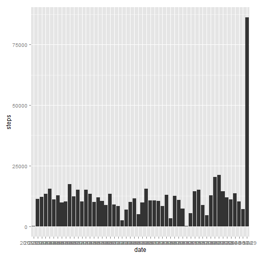

# Reproducible Research: Peer Assessment 1

This is the first asssignment for the Reproducible reserch course.

## Loading and preprocessing the data


```r
activity <- read.csv("activity.csv")
clean.activity <- activity[!is.na(activity),]
# transform the data into suitable format
good <- complete.cases(activity)
cactivity <- activity[good,]
```

# Plot the histogram using the ggplot system


```r
library(ggplot2)
g <- ggplot(cactivity, aes(date,steps))
g+geom_bar(stat="identity")
```

 

## What is mean total number of steps taken per day?


```r
cdata <- tapply(cactivity$steps,cactivity$date,sum)
summary(cdata)
```

```
##    Min. 1st Qu.  Median    Mean 3rd Qu.    Max.    NA's 
##      41    8840   10800   10800   13300   21200       8
```

## What is the average daily activity pattern?


```r
adata <- tapply(cactivity$steps,cactivity$interval,mean) # adata is the vector with average steps per interval
summary(adata) 
```

```
##    Min. 1st Qu.  Median    Mean 3rd Qu.    Max. 
##    0.00    2.49   34.10   37.40   52.80  206.00
```

Looking at the summary data we see 206.00 is the max value and it occurs at the interval **835**

## Imputing missing values

Imputing missing values is a tricky one and can be done in different ways. Looking at the above mean data for the entire dataset i have decided to use it (37.40)


```r
activity[which(is.na(activity)),] <- 37.40
```

```
## Warning: invalid factor level, NA generated
```

```r
library(ggplot2)
g <- ggplot(activity, aes(date,steps))
g+geom_bar(stat="identity")
```

 

## Are there differences in activity patterns between weekdays and weekends?
